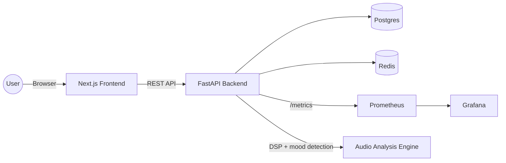

# Audio Visualizer

SonicLab is a full-stack audio analysis and visualization platform. It captures real-time audio, renders multiple visualizer modes, and logs analysis sessions with rich DSP metrics, mood detection, and user preferences. The backend exposes secure APIs and metrics for observability, while the frontend delivers a modern dashboard experience.

## What this project does

- Real-time audio visualization: spectrogram, spectrum bars, chromagram, constellation, and FFT graph.
- DSP metrics: BPM, spectral centroid, zero-crossing rate, peaks, dominant note, and more.
- Mood and audio-type classification from live analysis.
- Session history with persisted stats and metadata.
- Auth flow with access/refresh tokens and Redis-backed refresh tracking.
- Built-in metrics endpoint for Prometheus and pre-wired Grafana dashboards.

## Architecture

- Frontend: Next.js app with a dashboard, auth pages, and visualizer UI.
- Backend: FastAPI service with async SQLAlchemy, Redis, and JWT auth.
- Data: Postgres for users, settings, and session history; Redis for tokens.
- Observability: Prometheus scrape + Grafana dashboards.
- Infra: Docker Compose for local orchestration.

## Architecture diagram



## Tech stack

- Frontend: Next.js 14, React 18, Tailwind CSS, Zustand
- Backend: FastAPI, SQLAlchemy (async), Alembic, Redis, Passlib
- Data: Postgres 16
- Observability: Prometheus, Grafana

## Project structure

- backend/: FastAPI app, models, routes, migrations
- frontend/: Next.js app and UI components
- infra/: Prometheus and Grafana provisioning
- docker-compose.yml: Local services

## Local development

### Prerequisites

- Docker Desktop

### Start everything

```bash
docker compose up -d --build
```

### Service URLs

- Frontend: http://localhost:3000
- Backend API: http://localhost:8000
- Backend health: http://localhost:8000/health
- Metrics: http://localhost:8000/metrics
- Prometheus: http://localhost:9090
- Grafana: http://localhost:3001 (admin / admin)

## Core API endpoints (summary)

- POST /auth/register
- POST /auth/login
- POST /auth/refresh
- POST /auth/logout
- GET /auth/me
- GET /settings
- PUT /settings
- POST /sessions
- GET /sessions
- GET /sessions/stats
- GET /health
- GET /metrics

## Scalability (read-heavy)

- Stateless API layer: FastAPI stays stateless with JWTs, so the `backend` service can scale horizontally behind a load balancer as DAU rises.
- Read-optimized access: dashboard traffic is dominated by `GET /settings` and `GET /sessions`, which are cacheable and replica-friendly.
- Postgres reads: add read replicas for session history and settings; keep writes on the primary.
- Cache strategy: cache settings and recent sessions per user in Redis with short TTLs to absorb spikes.
- Metrics pipeline: Prometheus scrapes are pull-based, isolating observability from request latency.

### Read-heavy scaling playbook

- Low DAU: single API container + single Postgres + Redis; vertical scaling is sufficient.
- Mid DAU: add API replicas, enable connection pooling, and cache settings/session lists.
- High DAU: add Postgres read replicas, pre-aggregate session stats, and move heavy analytics to offline jobs.
- Very high DAU: introduce an async ingestion queue for sessions and keep UI reads isolated on replicas.

## Notes

- Passwords are hashed with bcrypt and passlib.
- The refresh token is stored server-side in Redis to support revocation.
- Prometheus metrics are exposed at /metrics and wired to Grafana.

## Technical details (PPT-ready)

### Key flows

- Audio analysis flow: Browser audio capture -> Web Audio processing -> visualizer rendering -> session payload -> backend persistence
- Auth flow: register/login -> bcrypt hash -> JWT access/refresh -> refresh stored in Redis -> cookie-based session
- Metrics flow: backend middleware -> Prometheus scrape -> Grafana dashboards

### Backend components

- API: FastAPI with async endpoints and CORS for the frontend origin
- Auth: JWT access/refresh tokens; refresh token jti stored in Redis
- Persistence: SQLAlchemy async models and Alembic migrations
- Metrics: Prometheus client middleware and counters for active users and analysis events

### Frontend components

- Pages: landing, auth, dashboard
- Visualizer: canvas-based render loop for spectrogram, FFT graph, chromagram, constellation
- State: Zustand store for HUD metrics and user preferences
- API client: typed REST calls for auth, sessions, settings

### Data model (summary)

- User: id, email, password_hash, created_at
- UserSettings: user_id, preferred_mode, color_theme, updated_at
- Session: user_id, mode, audio_type, bpm, peak_count, duration_seconds, mood, started_at, notes

### Security notes

- Password hashing: bcrypt via passlib
- Token model: short-lived access, longer-lived refresh
- Cookie settings: httpOnly, sameSite=lax (toggle secure in production)

### Observability

- /metrics exposes Prometheus counters and gauges
- Grafana dashboards pre-provisioned via infra/grafana

## Next ideas

- Add websocket streaming for live metrics
- Add multi-tenant teams and shared dashboards
- Export sessions to CSV/JSON
